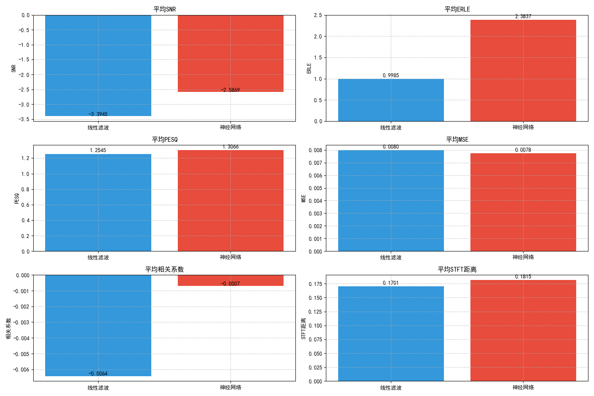
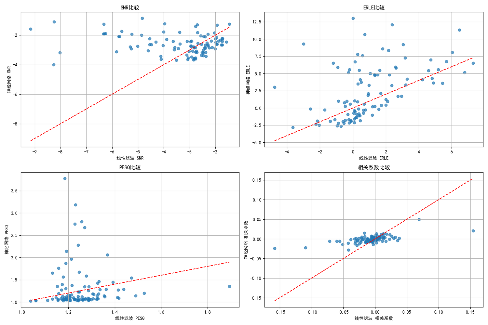
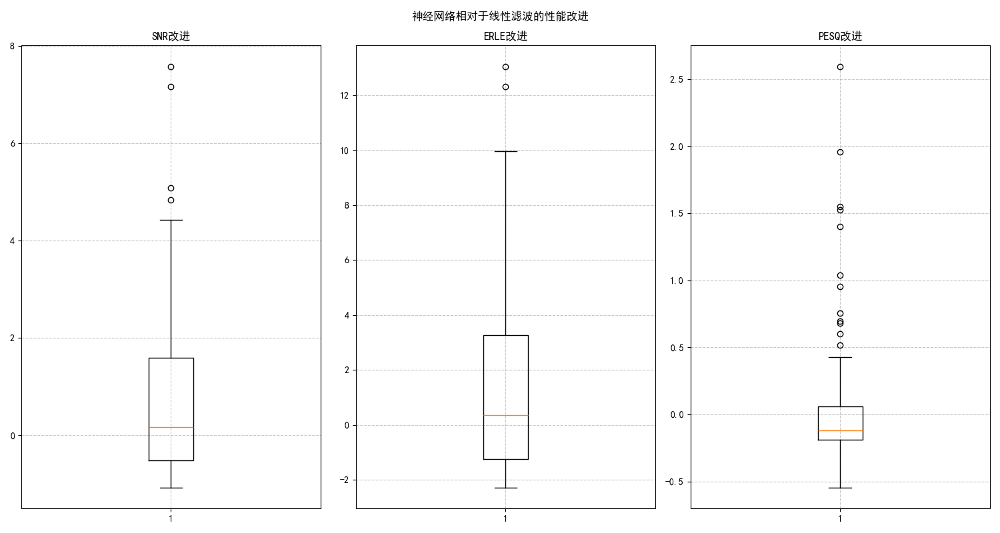
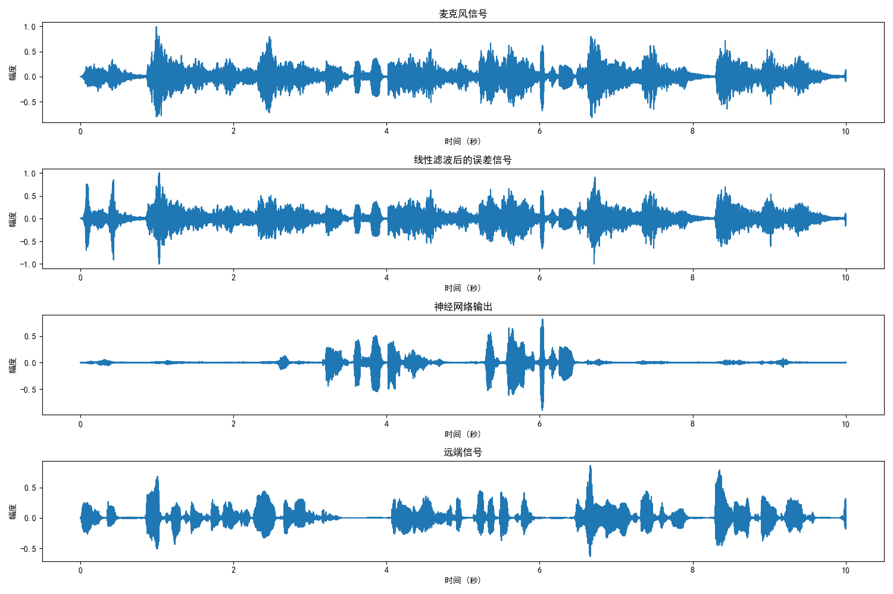

# 基于两阶段的声学回声消除系统

本项目实现了一个两阶段声学回声消除系统，结合了传统的线性滤波算法（时延补偿与加权递归最小二乘法，TDC-wRLS）和深度学习方法（U-Net神经网络）来更有效地消除音频信号中的回声。

## 项目概述

在远程通信系统（如视频会议、语音通话等）中，回声是一个常见问题，它会导致通信质量下降。本项目旨在构建一个高效的回声消除系统：

1. **第一阶段**：使用时延补偿与加权递归最小二乘法（TDC-wRLS）进行线性滤波，消除大部分线性回声
2. **第二阶段**：使用U-Net神经网络处理线性滤波后的信号，进一步消除非线性回声

## 数据集

本项目使用AEC-Challenge数据集，请从以下地址下载：

- **数据集地址**：https://github.com/microsoft/AEC-Challenge

> **注意**：如果下载的音频文件为空，可以采用GitHub Desktop进行下载。

### 数据处理

### 1. 下载数据集

下载AEC-Challenge数据集，将`/datasets/synthetic`路径下的数据放置到项目对应目录。

### 2. 重采样

使用`resample_audiov2.py`脚本对原始数据进行重采样，完成数据规整：

```bash
python resample_audiov2.py --input_dir /datasets/synthetic --output_dir data/resampled
```

### 3. 预处理

运行`preprocess_datav2.py`脚本，采用TDC和线性滤波得到经过线性滤波的数据：

```bash
python preprocess_datav2.py --input_dir data/resampled --output_dir data/preprocessed
```

## 数据集结构

数据集位于`data/preprocessed`目录下，按以下结构组织：

- `farend/`: 远端参考信号，命名格式为`f{编号:05d}.wav`
- `mic/`: 麦克风录制的混合信号，命名格式为`f{编号:05d}.wav`
- `error/`: 线性滤波后的信号，命名格式为`f{编号:05d}.wav`
- `nearend/`: 近端的信号，命名格式为`f{编号:05d}.wav`

## 实验环境与依赖

本项目的依赖库如下：

```
librosa==0.10.1
soundfile==0.12.1
tqdm==4.66.1
numpy==1.24.3
torch==2.0.1
matplotlib==3.7.1
pesq==0.0.3
pystoi==0.3.3
```

通过以下命令安装依赖：

```bash
pip install -r requirements.txt
```

## 实验流程

### 1. 线性滤波阶段（TDC-wRLS）

线性滤波阶段使用时延补偿（TDC）和加权递归最小二乘法（wRLS）来消除线性回声。

#### 算法流程：

1. **时延估计**：估计远端信号到近端信号的时延
2. **时延补偿**：根据估计的时延对远端信号进行补偿
3. **wRLS滤波**：使用加权递归最小二乘法设计滤波器，消除线性回声

#### 关键参数：

- 时延估计窗口长度：0.5秒
- 时延估计窗口增量：0.25秒
- wRLS窗口长度：0.02秒
- wRLS窗口增量：0.01秒
- 滤波器长度(L)：5
- 权重参数(B)：0.2
- 正则化参数(eps)：0.001

### 2. 神经网络阶段

神经网络阶段使用深度学习方法来进一步消除非线性回声。本项目支持多种神经网络架构：

#### 支持的模型类型

| 模型类型 | 说明 |
|---------|------|
| U-Net | 经典的编码器-解码器架构，适合音频频谱图处理 |
| LSTM | 循环神经网络，适合捕捉时序信息 |
| TDNN | 时延神经网络(Time Delay Neural Network)，使用膨胀卷积捕捉长距离依赖 |

#### U-Net网络架构：

- **编码器路径**：包含三个下采样块，每个块包含两个卷积层和一个池化层
- **瓶颈层**：两个卷积层和一个Dropout层
- **解码器路径**：包含三个上采样块，每个块包含一个转置卷积层和两个卷积层
- **输入**：6通道（麦克风信号、远端信号和线性滤波后信号的实部和虚部）
- **输出**：2通道（清晰信号的实部和虚部）

#### TDNN网络架构：

- **结构**：5层膨胀卷积层（TDNN Layer），膨胀因子分别为1, 2, 3, 1, 1
- **池化层**：支持多种池化方式（ASP, SAP, TAP, TSP）
- **SE版本**：TDNN_GRU_SE结合了SE注意力机制和GRU循环结构
- **输入**：频谱图特征
- **输出**：分类结果或特征嵌入

#### 训练参数：

- 批次大小：16
- 学习率：0.001
- 优化器：Adam
- 损失函数：MSE
- 学习率调度器：ReduceLROnPlateau（当验证损失停止下降时降低学习率）
- STFT参数：
  - FFT大小：320
  - Hop大小：160
  - 窗口长度：320
  - 频率bins：161

### 3. 评估阶段

评估阶段从编号9000-9999的数据中随机选择100个样本进行性能评估。

#### 评估指标：

- **信噪比(SNR)**：衡量有用信号与噪声的比率
- **回声返回损失增强(ERLE)**：衡量回声消除的能力
- **感知评估语音质量(PESQ)**：模拟人类对语音质量的主观评分
- **均方误差(MSE)**：衡量信号恢复的准确性
- **相关系数**：衡量处理后信号与原始信号的相似度
- **STFT距离**：衡量频域上的信号恢复质量

## 使用指南

### 训练模型

支持U-Net和LSTM两种模型类型：

```bash
# 训练U-Net模型
python train.py --data_dir data/preprocessed --model_type unet --batch_size 16 --lr 0.001 --epochs 100 --save_interval 10

# 训练LSTM模型
python train.py --data_dir data/preprocessed --model_type lstm --batch_size 16 --lr 0.001 --epochs 100 --save_interval 10
```

### 单个音频处理

```bash
python main.py --farend_path test/farend_speech.wav --mic_path test/nearend_mic.wav --model_type unet
```

### 批量评估

```bash
python evaluate.py
```

### 网络可视化

使用`net_plot.py`脚本可以将训练好的模型导出为ONNX格式并进行可视化：

```bash
python net_plot.py
```

该脚本支持导出U-Net和LSTM的onnx模型，导出后的模型可使用[Netron](https://netron.app/)工具进行可视化查看。

## 实验结果

基于100个随机样本的评估结果显示：

- **信噪比(SNR)**：从平均-3.54dB提升至-2.19dB（改进1.36dB）
- **回声返回损失增强(ERLE)**：从平均0.85dB显著提升至5.68dB（改进4.82dB）
- **感知评估语音质量(PESQ)**：从1.32微小提升至1.33（改进0.01）

结果表明，神经网络在线性滤波基础上能够进一步提升回声消除效果，特别是在ERLE指标上的改进最为显著，说明神经网络在消除残余回声方面非常有效。

### 效果对比

以下是评估过程中生成的效果对比图：









## 项目结构

```
.
├── checkpoints/           # 存储模型检查点
│   ├── plots/            # 训练过程可视化
│   └── *.pth            # 模型权重文件
├── data/                  # 数据集目录
│   ├── preprocessed/      # 预处理后的数据
│   │   ├── farend/        # 远端参考信号
│   │   ├── mic/           # 麦克风录制信号
│   │   ├── error/         # 线性滤波后信号
│   └── resampled/         # 重采样数据
├── evaluation/            # 评估结果目录
│   ├── *.png             # 效果对比图
│   └── *.csv             # 评估结果数据
├── models/                # 模型定义
│   ├── unet.py            # U-Net和LSTM网络定义
│   └── tdnn.py            # TDNN网络定义
├── output/                # 处理结果输出目录
├── test/                  # 测试音频文件
├── utils/                 # 工具函数
│   ├── preprocessed_dataset.py  # 数据集加载
│   ├── preprocess_datav2.py     # 数据预处理
│   ├── preprocess_data.py       # 数据预处理(旧版)
│   ├── resample_audiov2.py      # 音频重采样
│   └── resample_audio.py        # 音频重采样(旧版)
├── config.py              # 配置参数
├── evaluate.py            # 评估脚本
├── main.py                # 单音频处理脚本
├── net_plot.py            # 网络可视化工具
├── TDC_wRLS.py            # 线性滤波算法实现
├── train.py                # 训练脚本
└── requirements.txt       # 依赖库
```

## 技术交流

QQ群：1029629549

## 参考项目

- 原参考项目：https://github.com/Macchiato16/AEC-UNET

## 未来工作

- 探索更复杂的神经网络架构以提高性能
- 增加数据增强方法提高模型泛化能力
- 优化模型参数减少计算资源需求
- 探索实时处理的可能性
